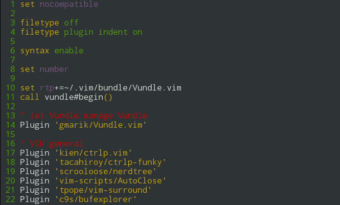

# vim-toggle-relative-line-numbers

This is a VIM plugin that toggles between standard line numbers and relative. I
placed it in a separate plugin to keep my vimrc tidy.

## Installation
Using Vundle
```
Plugin 'gangleri/vim-toggle-relative-line-numbers'
```

By default I have bound <leader>ln as the short cut.



